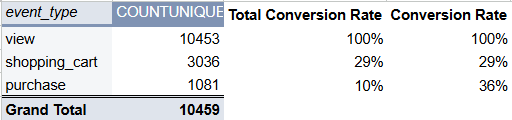
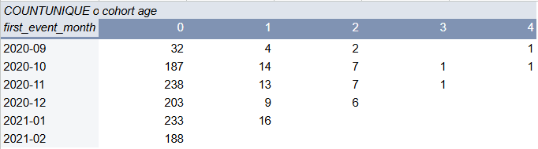
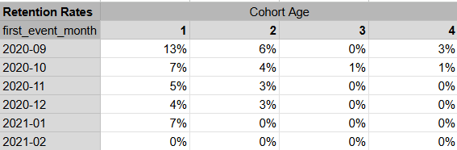

# 🛍️ E-Commerce Funnel & Cohort Analysis – Google Sheets

## 🚀 Overview  
This project transforms raw user activity logs into meaningful business metrics for an e-commerce platform. The analysis covers two core areas: a 3-step **conversion funnel** and a **cohort-based retention analysis** — both designed to evaluate user engagement and purchase behavior over time.

---

## 🧾 Dataset Description

- `user_id`: Unique identifier for each user  
- `event_type`: User activity event (`view`, `cart`, `purchase`)  
- `category_code`: Product category viewed or purchased  
- `brand`: Brand name  
- `price`: Product price (USD)  
- `event_date`: Date of user activity (`YYYY-MM-DD`)  

All events are logged in the `raw_user_activity` sheet.

---

## 📊 Analysis Summary

### 🔹 Part 1: Conversion Funnel
- Built a 3-step funnel: **Product View → Cart → Purchase**
- Counted unique users at each stage using pivot tables
- Calculated:
  - **Total conversion rate** (Purchase / View)
  - **Step conversion rate** (e.g., Cart → Purchase)

### 🔹 Part 2: Cohort Analysis
- Filtered purchases into a new table (`purchase_activity`)
- Identified **first purchase date** per user using pivot tables and `VLOOKUP`
- Created new columns:
  - `event_month`, `first_purchase_month` (via `TEXT`)
  - `cohort_age` (via `DATEDIF`)
- Grouped users into **monthly cohorts** and calculated **retention rates** (Month 1–4)

---

## 📈 Key Insights

- Only a small % of users progressed from **product views to purchase**, revealing drop-off opportunities  
- **Retention rates** dropped significantly after the first month — most cohorts showed engagement loss by Month 2  
- Users acquired in earlier months tended to have **slightly higher retention**, suggesting stronger long-term value  

---

## 📂 Files Included

- 📄 [📊 Google Sheet – Full Project](https://docs.google.com/spreadsheets/d/1XnVwInIWfrOc_4ZG6QGsCVZhw8VKs-qJqU01DGDc_dg/edit?usp=sharing)  
- `visuals/`: Screenshots of funnel, cohort analysis, and retention calculations  
- `README.md`: Project documentation  

---

## 🖼️ Dashboard Previews

### Conversion Funnel  

### Cohort Analysis  

### Retention Rates  

---

## ✅ Conclusion  
This project demonstrates how event logs can be structured into performance metrics using **advanced spreadsheet modeling**. From understanding user behavior at different funnel stages to tracking retention across monthly cohorts, this analysis provides clear, actionable insights for growth and engagement strategies.
